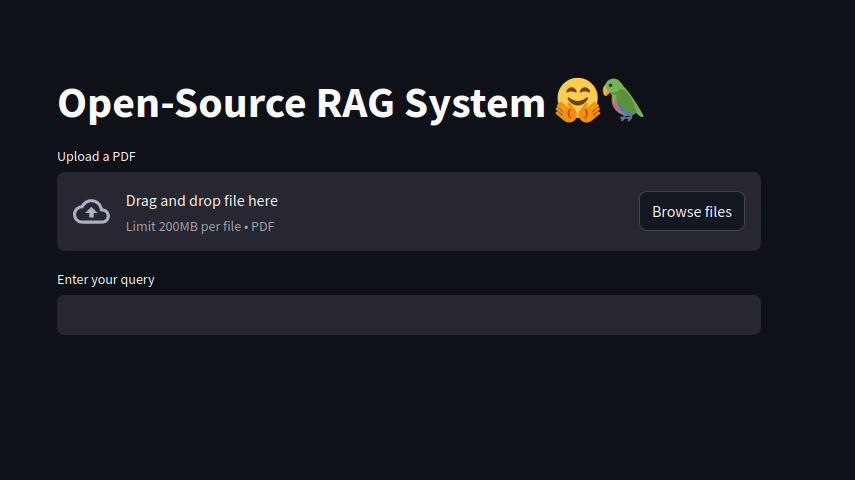
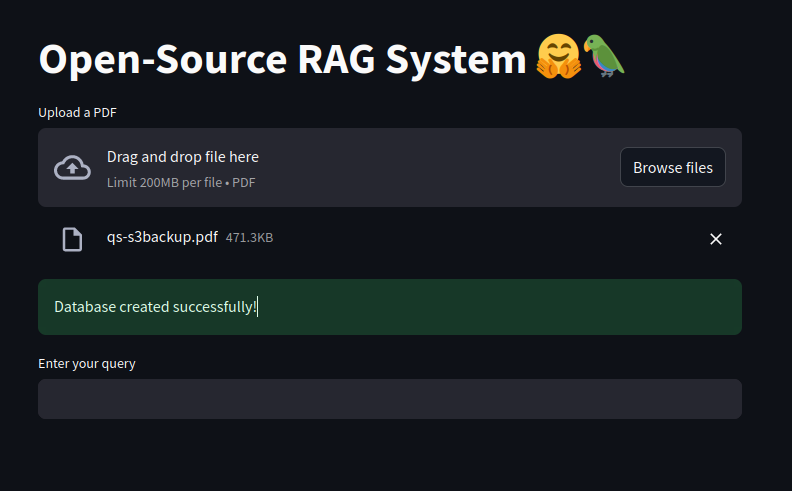
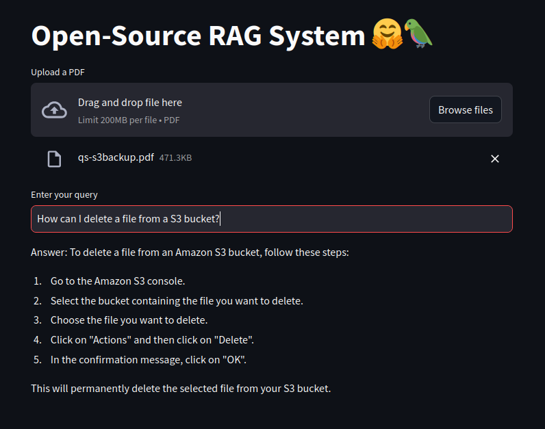

# Open Source RAG 🤗🦜

## Here's how you upload your files and ask him questions with Python, Langchain and HuggingFace, free of charge!

This project implements a Retrieval-Augmented Generation (RAG) system using user-uploaded PDF documents. The system allows the user to upload a PDF document and ask questions based on the content of the document. When a new PDF is uploaded, the system replaces the old document and recreates the vector database.

## Frameworks and libraries

* Langchain 🦜🔗: the framework responsible for orchestrating our NLP tasks
* Hugging Face 🤗: where the embedding model and LLM comes. We are using [bge-small-en](https://huggingface.co/BAAI/bge-small-en) to embedding and [zephyr-7b-alpha](https://huggingface.co/HuggingFaceH4/zephyr-7b-alpha) to LLM
* FAISS 📊: open-source vector database
* PyPDF 📄: to load the PDF files
* Streamlit 🔴: to view our application
* Docker 🐋: containerize our system

## Ways to Use the Application 

In this tutorial, I'll show to ways to use the application: installing dependencies manually and using Docker

## 1. Installing Manually 

### 1.1 Prerequisites

* Python 3.9 version or higher
* Pip (Python package manager)

### 1.2 Installation 

Clone the repository to your local machine:
 
``` 
git clone https://github.com/arturgomesc/Open-Source-RAG.git
cd Open-Source-RAG
```

Create a virtual environment and activate it:

``` 
python -m venv venv
source venv/bin/activate   # If you're using Windows, use `venv\Scripts\activate`
```

Install the required dependencies:

``` 
pip install -r requirements.txt
```

Create a `.env` file in the project root and add your Hugging Face token:

``` 
HUGGINGFACEHUB_API_TOKEN=hf_xxx
```

### 1.3 Executing the Application

Initialize a CMD on the project and run:

``` 
streamlit run app.py
```


## 2. Running the Application with Docker

### 2.1. Prerequisites

* Docker installed on your machine.

## 2.2. Building and Running the Docker Container

Clone the Repository:

``` 
git clone https://github.com/arturgomesc/rag-open-source-system.git
cd rag-open-source-system
```

Create a `.env` file in the project root and add your Hugging Face token:

``` 
HUGGINGFACEHUB_API_TOKEN=hf_xxx
```

Build the Docker image. In the directory where your Dockerfile is located, run the following command:

``` 
docker build -t rag-pdf-upload .
```

Run the Docker Container. After building the image, run the container with the following command:

``` 
docker run -p 8501:8501 --env HUGGINGFACEHUB_API_TOKEN=hf_xxx rag-pdf-upload
```


## Using the Applcation

You will be able to open a URL and see the this:



Upload your PDF file and wait until the success message



Now, you can make queries abbout your file! If you want to change the file, just upload other file and repeat the process



And here is an Open Source RAG running in front of you!